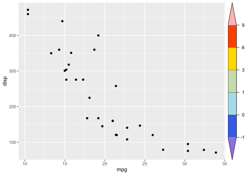
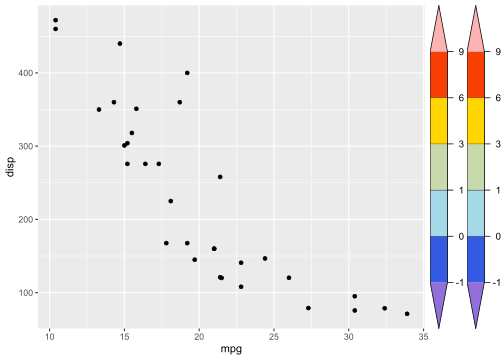
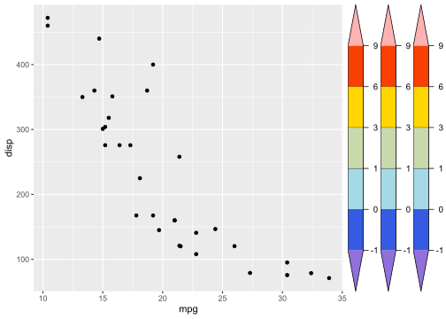

<!-- README.md is generated from README.Rmd. Please edit that file -->

# gg.layers

<!-- badges: start -->

[](https://github.com/rpkgs/gg.layers/actions)
[](https://codecov.io/gh/rpkgs/gg.layers)
[](https://cran.r-project.org/package=gg.layers)
<!-- badges: end -->

## Installation

You can install the development version of gg.layers from
[GitHub](https://github.com/) with:

``` r
# install.packages("devtools")
devtools::install_github("rpkgs/gg.layers")
```

## Example

This is a basic example which shows you how to solve a common problem:

``` r
library(gg.layers)
#> Registered S3 method overwritten by 'gg.layers':
#>   method       from  
#>   print.gtable gtable
library(ggplot2)
library(rcolors)

brk <- c(-Inf, -1, 0, 1, 3, 6, 9, Inf)
nbrk <- length(brk) - 1
cols <- get_color(rcolors$amwg256, nbrk)

g <- make_colorbar(
  at = brk, col = cols, height = 1,
  tck = 0.4,
  space = "right",
  legend.text.location = c(0.3, 0.5),
  legend.text.just = c(0.5, 0.5),
  # legend.text = list(fontfamily = "Times", cex = 1.1),
  hjust = 0.05
)

p <- ggplot(mtcars, aes(mpg, disp)) + geom_point()
p + g
```



``` r
p + g + g
```



``` r
p + g + g + g
```


